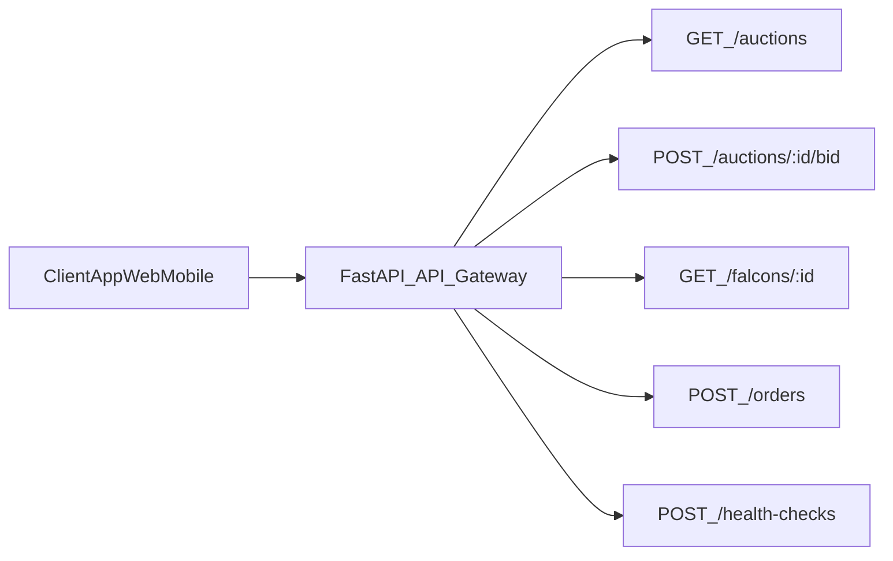

# Api Structure Diagram

```mermaid
flowchart LR
    CLIENT[ClientAppWebMobile] --> APIGW[FastAPI_API_Gateway]
    APIGW --> AUCTION[GET_/auctions]
    APIGW --> BID[POST_/auctions/:id/bid]
    APIGW --> FALCON[GET_/falcons/:id]
    APIGW --> ORDER[POST_/orders]
    APIGW --> HEALTH[POST_/health-checks]
```
