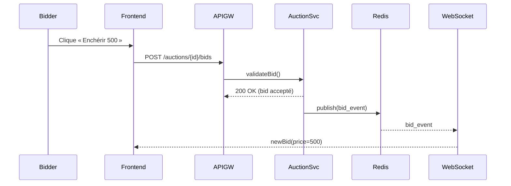

# Auction Live Flux Diagram

```mermaid
sequenceDiagram
    participant Bidder
    participant Frontend
    participant APIGW
    participant AuctionSvc
    participant Redis
    participant WebSocket
    Bidder->>Frontend: Clique « Enchérir 500 »
    Frontend->>APIGW: POST /auctions/{id}/bids
    APIGW->>AuctionSvc: validateBid()
    AuctionSvc-->>APIGW: 200 OK (bid accepté)
    AuctionSvc->>Redis: publish(bid_event)
    Redis-->>WebSocket: bid_event
    WebSocket-->>Frontend: newBid(price=500)
```
