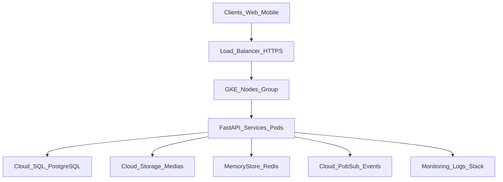

# GCP HOSTING Diagram

```mermaid
flowchart TD
    CLIENT[Clients_Web_Mobile] --> LB[Load_Balancer_HTTPS]
    LB --> IG[GKE_Nodes_Group]
    IG --> API[FastAPI_Services_Pods]
    API --> DB[Cloud_SQL_PostgreSQL]
    API --> GCS[Cloud_Storage_Medias]
    API --> REDIS[MemoryStore_Redis]
    API --> PUBSUB[Cloud_PubSub_Events]
    API --> ELK[Monitoring_Logs_Stack]
```
