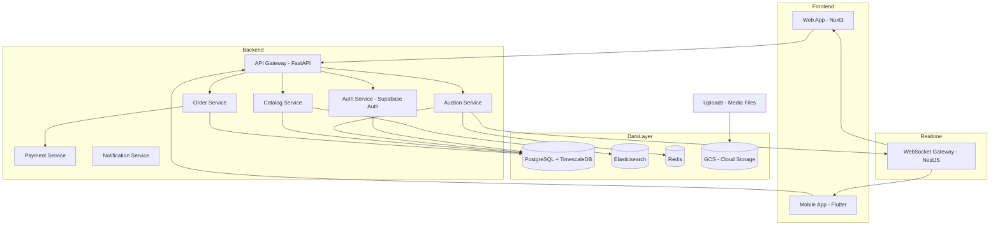

# Global Architecture Diagram

```mermaid
flowchart TD
    subgraph Frontend
        WEB[Web App - Nuxt3]
        MOB[Mobile App - Flutter]
    end

    subgraph Backend
        GW[API Gateway - FastAPI]
        AUTH[Auth Service - Supabase Auth]
        AUCTION[Auction Service]
        CATALOG[Catalog Service]
        ORDER[Order Service]
        PAYMENT[Payment Service]
        NOTIF[Notification Service]
    end

    subgraph DataLayer
        DB[(PostgreSQL + TimescaleDB)]
        SEARCH[(Elasticsearch)]
        CACHE[(Redis)]
        MEDIA[(GCS - Cloud Storage)]
    end

    WEB --> GW
    MOB --> GW
    GW --> AUTH
    GW --> AUCTION
    GW --> CATALOG
    GW --> ORDER
    ORDER --> PAYMENT
    AUTH --> DB
    AUCTION --> DB
    CATALOG --> DB
    ORDER --> DB
    CATALOG --> SEARCH
    AUCTION --> CACHE
    UPLOADS[Uploads - Media Files] --> MEDIA

    subgraph Realtime
        SOCKET[WebSocket Gateway - NestJS]
    end

    AUCTION --> SOCKET
    SOCKET --> WEB
    SOCKET --> MOB
```
