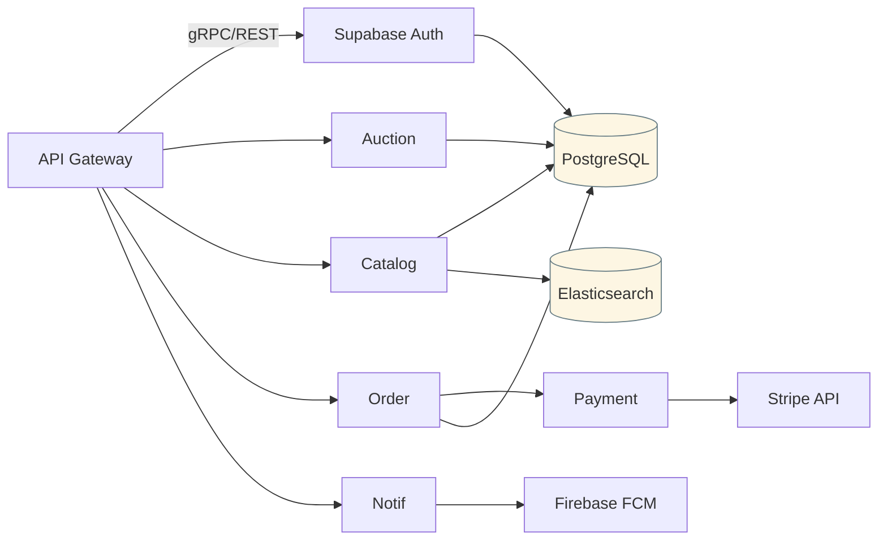

# Microservices Diagram

```mermaid
flowchart LR
    GW[API Gateway] -->|gRPC/REST| AUTH[Supabase Auth]
    GW --> AUCTION[Auction]
    GW --> CATALOG[Catalog]
    GW --> ORDER[Order]
    ORDER --> PAYMENT[Payment]
    GW --> NOTIF[Notif]
    PAYMENT --> Stripe[Stripe API]
    NOTIF --> FCM[Firebase FCM]
    classDef db fill:#fdf6e3,stroke:#657b83;
    PG[(PostgreSQL)]:::db
    ES[(Elasticsearch)]:::db
    AUCTION --> PG
    CATALOG --> PG
    ORDER --> PG
    AUTH --> PG
    CATALOG --> ES
```
