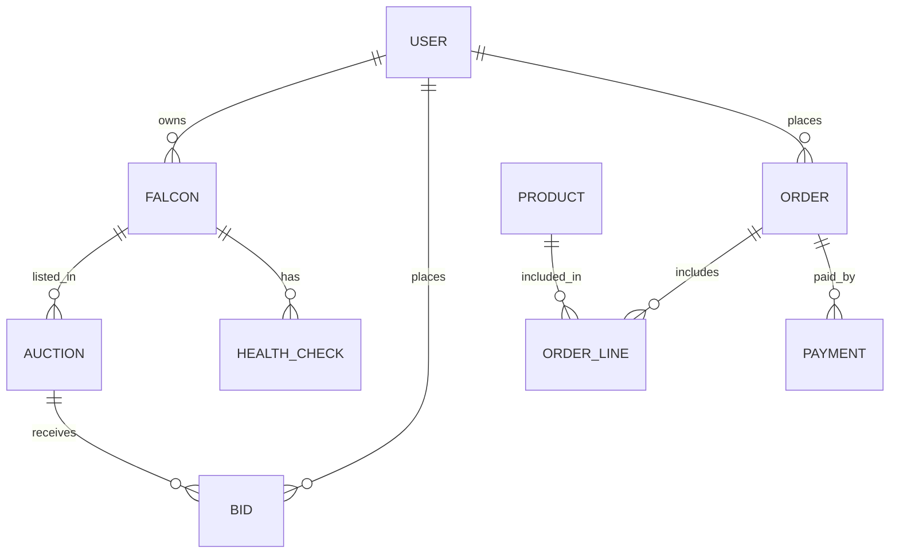

# Microservices Diagram

```mermaid
erDiagram
    USER ||--o{ FALCON : owns
    USER ||--o{ BID : places
    USER ||--o{ ORDER : places
    FALCON ||--o{ AUCTION : listed_in
    AUCTION ||--o{ BID : receives
    ORDER ||--o{ ORDER_LINE : includes
    PRODUCT ||--o{ ORDER_LINE : included_in
    ORDER ||--o{ PAYMENT : paid_by
    FALCON ||--o{ HEALTH_CHECK : has
```
