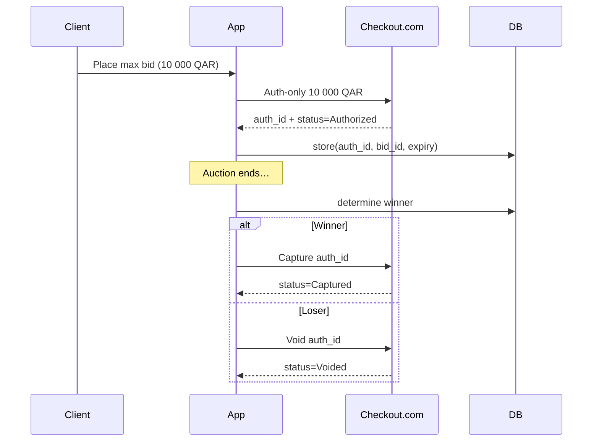

# Payment Sequence Diagram

```mermaid
sequenceDiagram
    participant Client
    participant App
    participant PSP as Checkout.com
    participant DB

    Client->>App: Place max bid (10 000 QAR)
    App->>PSP: Auth-only 10 000 QAR
    PSP-->>App: auth_id + status=Authorized
    App->>DB: store(auth_id, bid_id, expiry)

    Note over App: Auction ends…
    App->>DB: determine winner

    alt Winner
        App->>PSP: Capture auth_id
        PSP-->>App: status=Captured
    else Loser
        App->>PSP: Void auth_id
        PSP-->>App: status=Voided
    end
```
