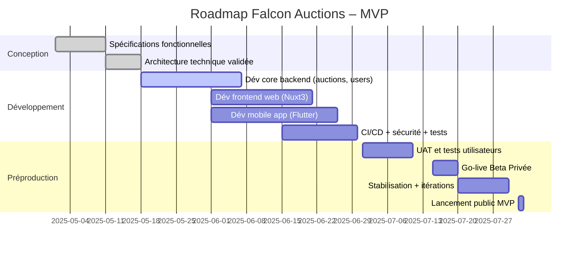

# CICD Diagram

```mermaid
gantt
dateFormat YYYY-MM-DD
title Roadmap Falcon Auctions – MVP

    section Conception
    Spécifications fonctionnelles       :done,    des1, 2025-05-01, 10d
    Architecture technique validée     :done,    des2, 2025-05-11, 7d

    section Développement
    Dév core backend (auctions, users) :active,  dev1, 2025-05-18, 20d
    Dév frontend web (Nuxt3)           :         dev2, 2025-06-01, 20d
    Dév mobile app (Flutter)           :         dev3, 2025-06-01, 25d
    CI/CD + sécurité + tests           :         dev4, 2025-06-15, 15d

    section Préproduction
    UAT et tests utilisateurs          :         test1, 2025-07-01, 10d
    Go-live Beta Privée                :         test2, 2025-07-15, 5d
    Stabilisation + itérations         :         stab,  2025-07-20, 10d
    Lancement public MVP               :         go,    2025-08-01, 1d
```
