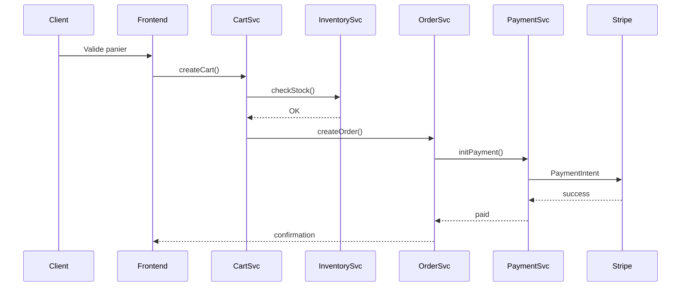

# Store Flux Diagram

```mermaid
sequenceDiagram
    participant Client
    participant Frontend
    participant CartSvc
    participant InventorySvc
    participant OrderSvc
    participant PaymentSvc
    participant Stripe
    Client->>Frontend: Valide panier
    Frontend->>CartSvc: createCart()
    CartSvc->>InventorySvc: checkStock()
    InventorySvc-->>CartSvc: OK
    CartSvc->>OrderSvc: createOrder()
    OrderSvc->>PaymentSvc: initPayment()
    PaymentSvc->>Stripe: PaymentIntent
    Stripe-->>PaymentSvc: success
    PaymentSvc-->>OrderSvc: paid
    OrderSvc-->>Frontend: confirmation
```
